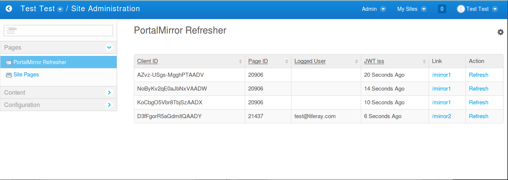

Inspired by [MagicMirror2](https://magicmirror.builders){:target="_blank"}

### Technology stack:

*   [**Liferay 6.2**](https://dev.liferay.com/develop/tutorials/-/knowledge_base/6-2/tutorials){:target="_blank"} - a Java Portal running on Java 7. Refresh-on-form-submit style. The legacy part of this project.   
*   [**Spring Portlet MVC**](https://docs.spring.io/autorepo/docs/spring/4.2.x/spring-framework-reference/html/portlet.html){:target="_blank"} - to make Portlet (Liferay's plugin) development familiar for Spring users.
*   **Kotlin** - It can be compiled to Java 7, so it also can be used to develop Portlets.
*   **ES6 Javascript** - To code single page app features in vanilla JS.
*   **Node.js** - To bypass Java Portlet spec limitations and add WebSockets.   

# Input devices
A mirror should support an optional input device that:
*   **is not a touch screen digitizer** - Fingerprints don't look good on reflective surfaces!
*   **is not a camera** - 1. People cover their laptop cameras for comfort of privacy. 2. A bedroom is a common place to install mirrors. It could be too creepy for many users to use cameras for gestures recognition. 
*   **is supported on Linux** - Unfortunately, Kinect requires a Windows client. 
*   **is cheap and easy to fit in the mirror's frame**

I've been looking for a device that match those requirements and I was inspired by the classic Apple iPod - it's big wheel and the central button. I figured out that the **mousewheel** that is in every computer mouse gives the same functionality and a similar feeling.

The mousewheel can send 3 events, scroll up', 'scroll down' and 'wheel pressed', and all of them can be handled by the code running in the browser.

Here is the Twitter feed reader plugin that makes use of the mousewheel. You can scroll though tweets of selected accounts and press to see the replies or play the video that is attached to the tweet.

{::options parse_block_html="true" /}
<video  controls loop>
<source src="twitter.webm" type="video/webm">
<source src="twitter.mp4" type="video/mp4">
</video>
{::options parse_block_html="false" /}
* * *

# Customization 
PortalMirror plugins are configurable from admin interface level. You can place adaptive components in any position on the mirror.
{::options parse_block_html="true" /}
<video  controls loop>
<source src="new_widgets-s.webm" type="video/webm">
<source src="new_widgets.mp4" type="video/mp4">
</video>
{::options parse_block_html="false" /}
* * *

Changes to the mirror setup are visible immediately - Single click to deploy to devices. 
{::options parse_block_html="true" /}
<video  controls loop>
<source src="deployment-s.webm" type="video/webm">
<source src="deployment.mp4" type="video/mp4">
</video>
{::options parse_block_html="false" /}
* * *

# Two way communication
With Server to Client communication it is possible to send messages to your mirror, for example, from your phone.  
{::options parse_block_html="true" /}
<video  controls loop>
<source src="flashmessage-s.webm" type="video/webm">
<source src="flashmessage.mp4" type="video/mp4">
</video>
{::options parse_block_html="false" /}
* * *

# CMS
Manage your devices from the control panel

# Other commercial products
Here is the list of other commercial products and concepts. Build your own, it's fun. 

*   [**MirroCool**](https://mirrocool.com){:target="_blank"}
*   [**Pesa Bydgoszcz DART**](http://www.vagonweb.cz/fotogalerie/PL/PKP_ED161.php?lang=en){:target="_blank"}
*   [**AbyssGlass**](http://abyssglass.com){:target="_blank"}
*   [**apple mirror**](http://www.rafaeldymek.com/portfolio/apple-mirror){:target="_blank"}
*   [**Perseus**](https://www.kickstarter.com/projects/1377326093/perseus-the-worlds-smartest-mirror){:target="_blank"}
*   [**PANL**](https://getpanl.com){:target="_blank"}
